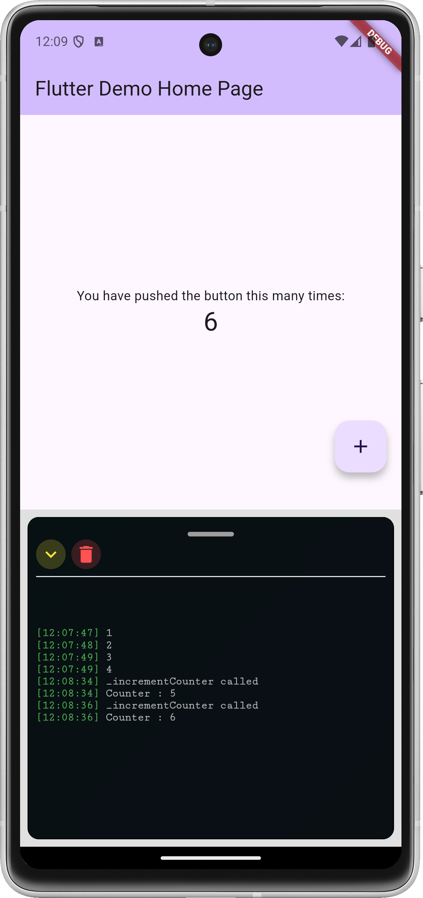

## Description

This package is used to show the terminal widget in your app.

## Getting started

This package is designed to display a terminal widget directly on the app screen,
assisting with debugging regardless of the build mode (Debug, Profile, or Release).

## Usage

```dart
Future<void> main() async {
  //Replace with your runApp();
  runAppWithDebuggingMode(
    appView: MaterialApp(), //Replace with your MyApp() or any widget uses
    usingDebugging: true, //By default uses -kDebugMode- if need show it on release mode make it true
  );
}
```



## Additional information
This package is currently not stable and is not recommended for production use.
